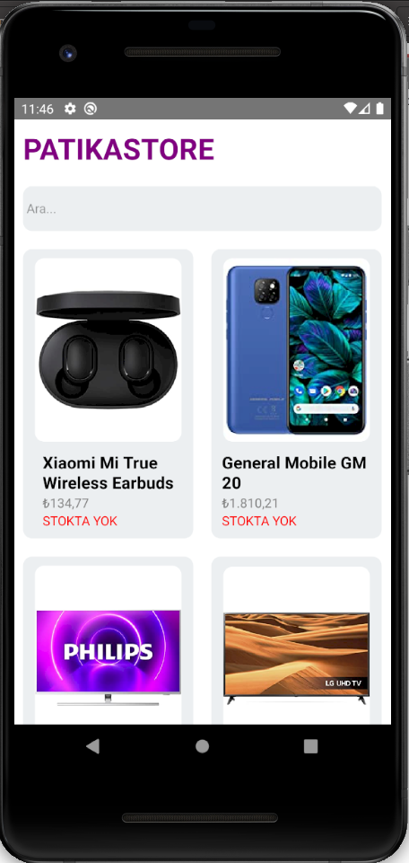
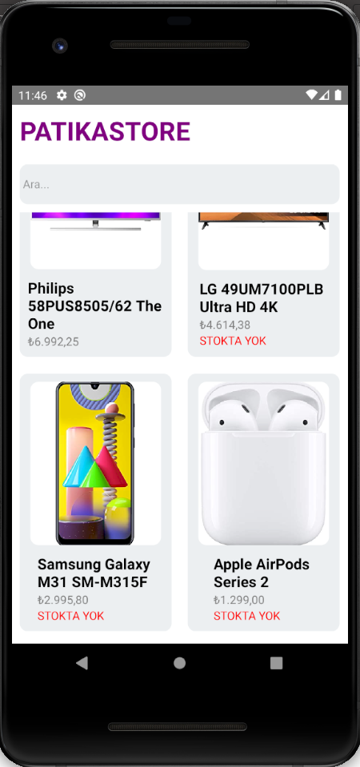

# Patika.dev React Native  Homework1

Ödeve uygun olarak bir patikaStore geliştirildi. json dosyasından veriler alındı ve flatlist kullanılarak ekranda listelendi 

<div style="justify-content: center;">


</div>

 

## Projenin Çalıştırılması
Proje indirildikten sonra, 'Visual Studio Code' editörü ile proje açılır. 

Terminalde;

```
npm install
```
komut satırı ile projede kullanılan paketler "node_modules" klasöründe oluşturulur.

```
npx react-native start
```

komutu çalıştırılır.

```
npx react-native run-android
```

komutu çalıştırılır.
